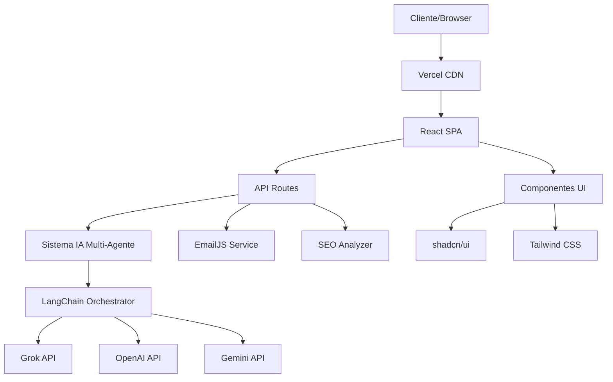
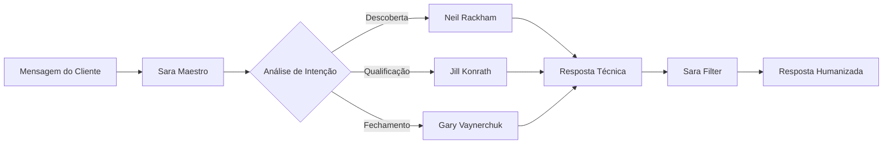
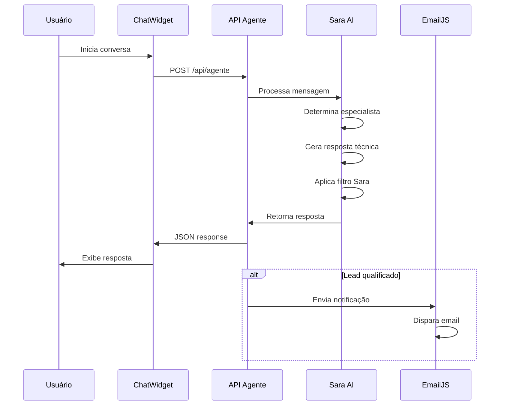
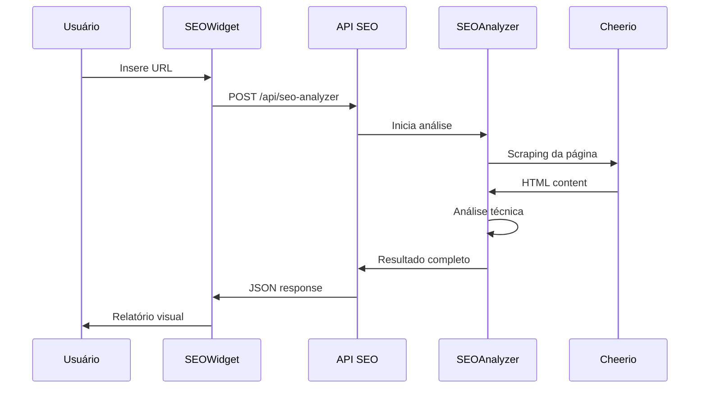

# Documentação Técnica - RonalDigital

## 📋 Índice

1. [Visão Geral](#visão-geral)
2. [Arquitetura do Sistema](#arquitetura-do-sistema)
3. [Stack Tecnológica](#stack-tecnológica)
4. [Estrutura do Projeto](#estrutura-do-projeto)
5. [Sistema de IA Multi-Agente](#sistema-de-ia-multi-agente)
6. [APIs e Endpoints](#apis-e-endpoints)
7. [Componentes Frontend](#componentes-frontend)
8. [Fluxos de Dados](#fluxos-de-dados)
9. [Configuração e Deploy](#configuração-e-deploy)
10. [Testes e Qualidade](#testes-e-qualidade)
11. [Monitoramento e Analytics](#monitoramento-e-analytics)
12. [Segurança](#segurança)
13. [Performance](#performance)
14. [Manutenção](#manutenção)

---

## 🎯 Visão Geral

### Descrição do Projeto
O **RonalDigital** é uma plataforma web moderna que combina um site institucional com um sistema avançado de IA multi-agente para captação, qualificação e vendas de serviços digitais. O projeto utiliza metodologias de vendas comprovadas (SPIN Selling, BANT, Value-First) implementadas através de agentes de IA especializados.

### Objetivos Principais
- **Captação Automatizada**: Sistema de IA para qualificar leads 24/7
- **Experiência do Usuário**: Interface moderna e responsiva
- **Conversão Otimizada**: Fluxos de vendas baseados em metodologias comprovadas
- **Escalabilidade**: Arquitetura serverless para crescimento sustentável

### Métricas de Sucesso
- Taxa de conversão de visitantes em leads: >15%
- Qualificação automática de leads: >80%
- Tempo de resposta da IA: <3 segundos
- Score de performance (Lighthouse): >90

---

## 🏗️ Arquitetura do Sistema

### Arquitetura Geral


### Padrões Arquiteturais
- **JAMstack**: JavaScript, APIs, Markup
- **Serverless**: Funções sob demanda na Vercel
- **Component-Based**: Arquitetura modular com React
- **API-First**: Separação clara entre frontend e backend
- **Multi-Agent System**: Orquestração de agentes especializados

### Fluxo de Dados Principal
1. **Entrada**: Cliente interage via chat/formulário
2. **Roteamento**: Sistema determina agente especialista apropriado
3. **Processamento**: Agente gera resposta técnica usando IA
4. **Humanização**: Sara AI aplica filtro de personalidade
5. **Saída**: Resposta personalizada entregue ao cliente

---

## 💻 Stack Tecnológica

### Frontend
| Tecnologia | Versão | Propósito |
|------------|--------|-----------|
| **React** | 18.3.1 | Framework principal |
| **TypeScript** | 5.5.3 | Tipagem estática |
| **Vite** | 5.4.1 | Build tool e dev server |
| **Tailwind CSS** | 3.4.11 | Framework CSS |
| **shadcn/ui** | Latest | Biblioteca de componentes |
| **React Router** | 6.26.2 | Roteamento SPA |
| **React Query** | 5.56.2 | Gerenciamento de estado |

### Backend/APIs
| Tecnologia | Versão | Propósito |
|------------|--------|-----------|
| **Node.js** | 18+ | Runtime JavaScript |
| **Vercel Functions** | Latest | Serverless functions |
| **LangChain** | 0.3.0 | Orquestração de IA |
| **EmailJS** | 4.4.1 | Serviço de email |

### Integrações de IA
| Serviço | Modelo | Uso |
|---------|--------|-----|
| **Grok (xAI)** | mixtral-8x7b-32768 | Principal |
| **OpenAI** | gpt-3.5-turbo | Fallback |
| **Google Gemini** | gemini-1.5-pro | Backup |

### Ferramentas de Desenvolvimento
| Ferramenta | Propósito |
|------------|-----------|
| **ESLint** | Linting de código |
| **Prettier** | Formatação de código |
| **TypeScript** | Verificação de tipos |
| **Vite** | Hot reload e build |

---

## 📁 Estrutura do Projeto

### Organização de Diretórios
```
ronald-digital/
├── 📁 api/                    # Serverless functions
│   ├── agente.js             # Endpoint principal da IA
│   └── seo-analyzer.js       # Analisador SEO
├── 📁 data/                  # Configurações dos agentes
│   ├── maestro.json          # Orquestrador principal
│   ├── sara_personality.json # Personalidade da Sara
│   ├── persona_rackham.json  # Neil Rackham (SPIN)
│   ├── persona_konrath.json  # Jill Konrath (BANT)
│   └── persona_vaynerchuk.json # Gary Vaynerchuk (Value)
├── 📁 lib/                   # Bibliotecas e utilitários
│   ├── 📁 agents/           # Sistema de IA
│   ├── 📁 config/           # Configurações
│   └── 📁 seo/              # Ferramentas SEO
├── 📁 src/                   # Código fonte frontend
│   ├── 📁 components/       # Componentes React
│   │   ├── 📁 ui/           # Componentes base (shadcn)
│   │   ├── 📁 layout/       # Layout components
│   │   ├── 📁 sections/     # Seções da página
│   │   ├── 📁 chat/         # Sistema de chat
│   │   ├── 📁 budget/       # Wizard de orçamento
│   │   └── 📁 seo/          # Ferramentas SEO
│   ├── 📁 pages/            # Páginas da aplicação
│   ├── 📁 hooks/            # Custom hooks
│   ├── 📁 services/         # Serviços e APIs
│   └── 📁 lib/              # Utilitários frontend
├── 📁 test/                  # Testes automatizados
└── 📁 docs/                  # Documentação
```

### Convenções de Nomenclatura
- **Componentes**: PascalCase (`HeroSection.tsx`)
- **Hooks**: camelCase com prefixo `use` (`useChat.ts`)
- **Utilitários**: camelCase (`formatPrice.ts`)
- **Constantes**: UPPER_SNAKE_CASE (`API_ENDPOINTS`)
- **Arquivos de configuração**: kebab-case (`tailwind.config.ts`)

---

## 🤖 Sistema de IA Multi-Agente

### Arquitetura dos Agentes


### Agentes Especializados

#### 1. Sara Maestro (Orquestrador)
```json
{
  "role": "Inteligência Central com Escuta Ativa",
  "responsibilities": [
    "Análise de intenção da mensagem",
    "Roteamento para especialista apropriado",
    "Manutenção do contexto da conversa",
    "Aplicação de filtro de personalidade"
  ],
  "decision_matrix": {
    "perguntas_diretas": "Resposta imediata",
    "expressoes_duvida": "Convite para continuar",
    "continuacao_conversa": "Roteamento para especialista",
    "saudacoes": "Qualificação sutil"
  }
}
```

#### 2. Neil Rackham (SPIN Selling)
```json
{
  "methodology": "SPIN Selling",
  "focus": "Descoberta consultiva de necessidades",
  "question_types": {
    "Situation": "Qual sua situação atual?",
    "Problem": "Que desafios você enfrenta?",
    "Implication": "Como isso afeta seu negócio?",
    "Need-payoff": "Que benefícios você busca?"
  },
  "triggers": [
    "não sei o que preciso",
    "tenho um problema",
    "quais opções",
    "preciso de ajuda para"
  ]
}
```

#### 3. Jill Konrath (BANT Qualification)
```json
{
  "methodology": "BANT Qualification",
  "focus": "Qualificação objetiva e eficiente",
  "qualification_criteria": {
    "Budget": "Orçamento disponível",
    "Authority": "Poder de decisão",
    "Need": "Necessidade real",
    "Timeline": "Prazo para implementação"
  },
  "triggers": [
    "quanto custa",
    "preço",
    "orçamento",
    "prazo",
    "especificações"
  ]
}
```

#### 4. Gary Vaynerchuk (Value-First)
```json
{
  "methodology": "Value-First Approach",
  "focus": "Construção de relacionamento e valor",
  "strategies": [
    "Demonstração de expertise",
    "Oferecimento de conteúdo gratuito",
    "Construção de confiança",
    "Fechamento consultivo"
  ],
  "triggers": [
    "quero saber mais",
    "me envie material",
    "gostei",
    "interessante"
  ]
}
```

### Sistema de Fallback
```javascript
// Hierarquia de fallback para APIs
const apiPriority = [
  'grok',     // Principal (gratuito)
  'openai',   // Fallback (pago)
  'gemini'    // Backup (gratuito com limites)
];

// Fallback inteligente quando IA falha
function getIntelligentFallback(message, userInfo) {
  // Análise de padrões na mensagem
  // Resposta contextual baseada em templates
  // Manutenção da experiência do usuário
}
```

---

## 🔌 APIs e Endpoints

### Endpoint Principal: `/api/agente`
```typescript
interface AgenteRequest {
  nome: string;
  email: string;
  mensagem: string;
  tipoServico?: string;
  chatHistory?: ChatMessage[];
}

interface AgenteResponse {
  success: boolean;
  resposta: string;
  etapa: 'captacao' | 'qualificacao' | 'vendas' | 'fallback';
  leadScore: number; // 0-4
  proximaAcao: string;
  agenteAtivo: string;
  timestamp: string;
  data?: object;
}
```

### Endpoint SEO: `/api/seo-analyzer`
```typescript
interface SEORequest {
  url: string;
}

interface SEOResponse {
  success: boolean;
  url: string;
  score: number; // 0-100
  analysis: {
    title: AnalysisItem;
    meta_description: AnalysisItem;
    headings: AnalysisItem;
    images: AnalysisItem;
    performance: AnalysisItem;
  };
  technicalData: TechnicalData;
  timestamp: string;
}
```

### Configuração CORS
```javascript
const corsOptions = {
  origin: process.env.VERCEL_URL || "*",
  methods: ["POST", "OPTIONS"],
  allowedHeaders: ["Content-Type", "Authorization"]
};
```

### Rate Limiting
- **Limite por IP**: 100 requests/hora
- **Timeout**: 30 segundos por request
- **Retry Logic**: 3 tentativas com backoff exponencial

---

## 🎨 Componentes Frontend

### Hierarquia de Componentes
```
App
├── Layout
│   ├── Header
│   │   ├── Logo
│   │   └── Navigation
│   └── Footer
├── Pages
│   ├── Home
│   │   ├── HeroSection
│   │   ├── ServicesSection
│   │   └── TestimonialsSection
│   ├── About
│   ├── Services
│   ├── Portfolio
│   ├── Contact
│   ├── Orcamento (BudgetWizard)
│   ├── SaraAI (ChatWidget)
│   └── SEOAnalyzer
└── Shared Components
    ├── ChatWidget
    ├── BudgetWizard
    └── SEOAnalyzerWidget
```

### Componentes Principais

#### 1. ChatWidget
```typescript
interface ChatWidgetProps {
  initialMessage?: string;
  userInfo?: UserInfo;
  onLeadGenerated?: (lead: Lead) => void;
}

// Funcionalidades:
// - Chat em tempo real com IA
// - Histórico de conversa
// - Indicadores de typing
// - Fallback para formulário
```

#### 2. BudgetWizard
```typescript
interface BudgetWizardProps {
  onComplete?: (budget: BudgetData) => void;
  steps?: WizardStep[];
}

// Funcionalidades:
// - Wizard multi-step
// - Validação em tempo real
// - Cálculo automático de preços
// - Integração com sistema de IA
```

#### 3. SEOAnalyzerWidget
```typescript
interface SEOAnalyzerProps {
  onAnalysisComplete?: (result: SEOResult) => void;
}

// Funcionalidades:
// - Análise técnica de SEO
// - Relatório visual
// - Sugestões de melhoria
// - Export de resultados
```

### Sistema de Design

#### Tokens de Design
```css
:root {
  /* Cores Primárias */
  --primary: 194 100% 50%;        /* #00C2FF */
  --primary-foreground: 0 0% 100%; /* #FFFFFF */
  
  /* Cores Secundárias */
  --secondary: 210 40% 98%;       /* #F8FAFC */
  --secondary-foreground: 222 84% 5%; /* #0F172A */
  
  /* Tipografia */
  --font-display: 'Inter', system-ui, sans-serif;
  --font-body: 'Inter', system-ui, sans-serif;
  
  /* Espaçamento */
  --spacing-xs: 0.25rem;  /* 4px */
  --spacing-sm: 0.5rem;   /* 8px */
  --spacing-md: 1rem;     /* 16px */
  --spacing-lg: 1.5rem;   /* 24px */
  --spacing-xl: 2rem;     /* 32px */
  
  /* Bordas */
  --radius: 0.5rem;       /* 8px */
}
```

#### Animações
```css
/* Animações customizadas */
@keyframes fade-up {
  0% { opacity: 0; transform: translateY(30px); }
  100% { opacity: 1; transform: translateY(0); }
}

@keyframes float {
  0%, 100% { transform: translateY(0px); }
  50% { transform: translateY(-20px); }
}

@keyframes glow {
  0%, 100% { box-shadow: 0 0 20px hsl(var(--primary) / 0.3); }
  50% { box-shadow: 0 0 40px hsl(var(--primary) / 0.6); }
}
```

---

## 🔄 Fluxos de Dados

### Fluxo de Captação de Leads


### Fluxo de Análise SEO


### Estado Global da Aplicação
```typescript
// Gerenciamento de estado com React Query
interface AppState {
  user: UserInfo | null;
  chatHistory: ChatMessage[];
  currentLead: Lead | null;
  seoResults: SEOResult[];
  budgetData: BudgetData | null;
}

// Queries principais
const queries = {
  chatHistory: useQuery(['chat', userId]),
  leadData: useQuery(['lead', leadId]),
  seoAnalysis: useQuery(['seo', url])
};
```

---

## ⚙️ Configuração e Deploy

### Variáveis de Ambiente
```bash
# APIs de IA
GROK_API_KEY=your_grok_api_key_here
OPENAI_API_KEY=your_openai_api_key_here
GEMINI_API_KEY=your_gemini_api_key_here

# Configurações do Negócio
BUSINESS_EMAIL=ronald.digital27@gmail.com
BUSINESS_PHONE=5585991575525
BUSINESS_NAME=RonalDigital

# Faixas de Preço
LANDING_PAGE_MIN=500
LANDING_PAGE_MAX=1000
PORTFOLIO_MIN=400
PORTFOLIO_MAX=800
WEBSITE_MIN=800
WEBSITE_MAX=2000

# EmailJS
EMAILJS_SERVICE_ID=your_service_id
EMAILJS_TEMPLATE_ID=your_template_id
EMAILJS_PUBLIC_KEY=your_public_key

# Vercel
VERCEL_URL=https://your-domain.vercel.app
```

### Scripts de Build
```json
{
  "scripts": {
    "dev": "vite",
    "build": "vite build",
    "build:dev": "vite build --mode development",
    "preview": "vite preview",
    "lint": "eslint .",
    "test": "node test/test-sara-ai.js"
  }
}
```

### Configuração Vercel
```json
{
  "functions": {
    "api/agente.js": {
      "maxDuration": 30
    },
    "api/seo-analyzer.js": {
      "maxDuration": 45
    }
  },
  "rewrites": [
    {
      "source": "/(.*)",
      "destination": "/index.html"
    }
  ]
}
```

### Pipeline de Deploy
1. **Desenvolvimento**: `npm run dev` (localhost:5173)
2. **Build**: `npm run build` (otimização automática)
3. **Preview**: `npm run preview` (teste local do build)
4. **Deploy**: `vercel --prod` (deploy automático)

---

## 🧪 Testes e Qualidade

### Estratégia de Testes
```
Testes/
├── 📁 unit/              # Testes unitários
├── 📁 integration/       # Testes de integração
├── 📁 e2e/              # Testes end-to-end
└── 📁 performance/      # Testes de performance
```

### Testes Implementados
```javascript
// test/test-sara-ai.js
const testCases = [
  {
    name: "Lead Quente - Orçamento + Prazo",
    input: {
      nome: "João Silva",
      email: "joao@empresa.com",
      mensagem: "Preciso de uma landing page para minha loja, orçamento de R$ 800, para próxima semana"
    },
    expected: {
      leadScore: 4,
      etapa: "vendas"
    }
  },
  {
    name: "Lead Morno - Interesse sem urgência",
    input: {
      nome: "Maria Santos",
      email: "maria@email.com", 
      mensagem: "Gostaria de saber mais sobre portfólios"
    },
    expected: {
      leadScore: 2,
      etapa: "qualificacao"
    }
  }
];
```

### Métricas de Qualidade
- **Cobertura de Código**: >80%
- **Performance Score**: >90 (Lighthouse)
- **Accessibility Score**: >95 (WCAG 2.1)
- **SEO Score**: >90
- **Best Practices**: >90

### Ferramentas de Qualidade
```json
{
  "eslint": "Linting de código",
  "prettier": "Formatação automática",
  "typescript": "Verificação de tipos",
  "lighthouse": "Auditoria de performance",
  "axe": "Testes de acessibilidade"
}
```

---

## 📊 Monitoramento e Analytics

### Métricas de Negócio
```typescript
interface BusinessMetrics {
  // Conversão
  visitorsToLeads: number;      // Taxa de conversão
  leadsToCustomers: number;     // Taxa de fechamento
  averageLeadScore: number;     // Qualidade dos leads
  
  // Performance
  chatResponseTime: number;     // Tempo de resposta da IA
  apiSuccessRate: number;       // Taxa de sucesso das APIs
  userSatisfaction: number;     // Satisfação do usuário
  
  // Uso
  dailyActiveUsers: number;     // Usuários ativos diários
  chatInteractions: number;     // Interações com chat
  seoAnalyses: number;         // Análises SEO realizadas
}
```

### Dashboard de Métricas
```javascript
// Integração com Google Analytics
gtag('event', 'lead_generated', {
  event_category: 'conversion',
  event_label: leadScore,
  value: leadScore
});

// Métricas customizadas
const trackChatInteraction = (stage, agent) => {
  analytics.track('chat_interaction', {
    conversation_stage: stage,
    active_agent: agent,
    timestamp: new Date().toISOString()
  });
};
```

### Alertas e Notificações
- **API Failures**: >5% de falha em 5 minutos
- **Response Time**: >5 segundos de resposta
- **Lead Quality**: Score médio <2.0
- **Error Rate**: >1% de erros JavaScript

---

## 🔒 Segurança

### Medidas de Segurança Implementadas

#### 1. Validação de Input
```typescript
// Validação com Zod
const messageSchema = z.object({
  nome: z.string().min(2).max(100),
  email: z.string().email(),
  mensagem: z.string().min(10).max(1000),
  tipoServico: z.string().optional()
});
```

#### 2. Rate Limiting
```javascript
// Limite por IP
const rateLimiter = {
  windowMs: 60 * 60 * 1000, // 1 hora
  max: 100, // 100 requests por hora
  message: "Muitas tentativas, tente novamente em 1 hora"
};
```

#### 3. Sanitização de Dados
```javascript
// Limpeza de HTML/XSS
const sanitizeInput = (input) => {
  return DOMPurify.sanitize(input, {
    ALLOWED_TAGS: [],
    ALLOWED_ATTR: []
  });
};
```

#### 4. Proteção de APIs
```javascript
// Headers de segurança
const securityHeaders = {
  'X-Content-Type-Options': 'nosniff',
  'X-Frame-Options': 'DENY',
  'X-XSS-Protection': '1; mode=block',
  'Referrer-Policy': 'strict-origin-when-cross-origin'
};
```

### Compliance e Privacidade
- **LGPD**: Conformidade com Lei Geral de Proteção de Dados
- **Cookies**: Apenas essenciais, sem tracking
- **Data Retention**: Dados removidos após 90 dias de inatividade
- **Encryption**: HTTPS obrigatório, dados em trânsito criptografados

---

## ⚡ Performance

### Otimizações Implementadas

#### 1. Frontend
```typescript
// Code splitting por rota
const Home = lazy(() => import('./pages/Home'));
const About = lazy(() => import('./pages/About'));

// Preload de recursos críticos
<link rel="preload" href="/fonts/inter.woff2" as="font" type="font/woff2" crossorigin>

// Lazy loading de imagens

```

#### 2. Bundle Optimization
```javascript
// Vite config para otimização
export default defineConfig({
  build: {
    rollupOptions: {
      output: {
        manualChunks: {
          vendor: ['react', 'react-dom'],
          ui: ['@radix-ui/react-dialog', '@radix-ui/react-dropdown-menu']
        }
      }
    }
  }
});
```

#### 3. Caching Strategy
```javascript
// Service Worker para cache
const CACHE_NAME = 'ronaldigital-v1';
const urlsToCache = [
  '/',
  '/static/css/main.css',
  '/static/js/main.js'
];
```

### Métricas de Performance
- **First Contentful Paint**: <1.5s
- **Largest Contentful Paint**: <2.5s
- **Cumulative Layout Shift**: <0.1
- **First Input Delay**: <100ms
- **Time to Interactive**: <3s

### Monitoramento Contínuo
```javascript
// Web Vitals tracking
import { getCLS, getFID, getFCP, getLCP, getTTFB } from 'web-vitals';

getCLS(console.log);
getFID(console.log);
getFCP(console.log);
getLCP(console.log);
getTTFB(console.log);
```

---

## 🔧 Manutenção

### Rotinas de Manutenção

#### 1. Atualizações de Dependências
```bash
# Verificar dependências desatualizadas
npm outdated

# Atualizar dependências menores
npm update

# Atualizar dependências maiores (com cuidado)
npm install package@latest
```

#### 2. Monitoramento de APIs
```javascript
// Health check das APIs de IA
const healthCheck = async () => {
  const apis = ['grok', 'openai', 'gemini'];
  const results = await Promise.allSettled(
    apis.map(api => testAPI(api))
  );
  return results;
};
```

#### 3. Backup de Dados
```javascript
// Backup de configurações dos agentes
const backupAgentData = () => {
  const agentFiles = [
    'data/maestro.json',
    'data/sara_personality.json',
    'data/persona_rackham.json',
    'data/persona_konrath.json',
    'data/persona_vaynerchuk.json'
  ];
  // Implementar backup automático
};
```

### Troubleshooting Guide

#### Problemas Comuns
1. **IA não responde**: Verificar chaves de API
2. **Erro de CORS**: Verificar configuração de domínios
3. **Performance lenta**: Verificar bundle size
4. **Erro de build**: Verificar dependências

#### Logs e Debugging
```javascript
// Sistema de logs estruturado
const logger = {
  info: (message, data) => console.log(`[INFO] ${message}`, data),
  warn: (message, data) => console.warn(`[WARN] ${message}`, data),
  error: (message, error) => console.error(`[ERROR] ${message}`, error)
};
```

### Roadmap de Melhorias
- [ ] Implementar testes E2E com Playwright
- [ ] Adicionar PWA capabilities
- [ ] Implementar analytics avançados
- [ ] Otimizar SEO técnico
- [ ] Adicionar suporte a múltiplos idiomas
- [ ] Implementar A/B testing
- [ ] Adicionar integração com CRM
- [ ] Melhorar sistema de cache

---

## 📞 Suporte e Contato

### Informações de Contato
- **Email**: ronald.digital27@gmail.com
- **WhatsApp**: +55 85 99157-5525
- **Website**: https://ronaldigital.vercel.app

### Documentação Adicional
- [README.md](./README.md) - Guia de instalação
- [CONFIGURACAO_AGENTE_IA.md](./CONFIGURACAO_AGENTE_IA.md) - Configuração dos agentes
- [CONFIGURACAO_EMAILJS.md](./CONFIGURACAO_EMAILJS.md) - Configuração do EmailJS

---

*Documentação atualizada em: Novembro 2024*
*Versão: 2.0*
*Autor: RonalDigital Team*