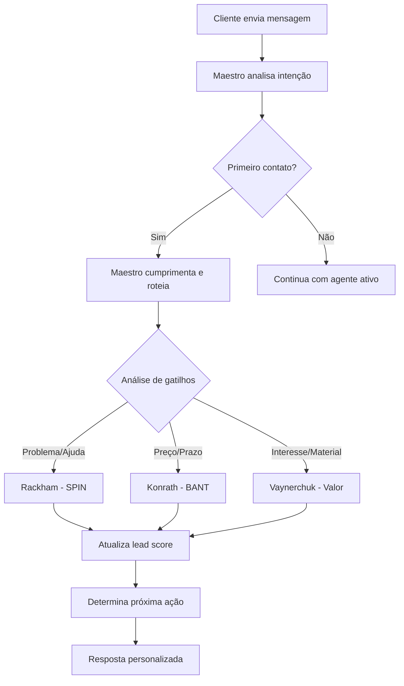

# 🧠 Sara AI - Mega Cérebro Multi-Agente

## Visão Geral

A Sara AI é um sistema revolucionário de inteligência artificial que combina as melhores metodologias de vendas do mundo em uma única plataforma. Ela utiliza um sistema multi-agente orquestrado por um "Maestro" que roteia conversas para especialistas específicos baseado na intenção do cliente.

## 🎭 Arquitetura do Sistema

### Maestro (Orquestrador)

- **Função**: Analisa a intenção inicial do cliente e roteia para o agente apropriado
- **Localização**: `data/maestro.json`
- **Responsabilidades**:
  - Cumprimentar o cliente
  - Analisar intenção da mensagem
  - Rotear para o agente especializado
  - Manter contexto da conversa

### Agentes Especializados

#### 1. Neil Rackham (Vendas Consultivas)

- **Metodologia**: SPIN Selling
- **Arquivo**: `data/persona_rackham.json`
- **Especialidade**: Descoberta de necessidades profundas
- **Gatilhos**: "não sei o que preciso", "problema", "ajuda"
- **Perguntas SPIN**:
  - **Situação**: Entender o contexto atual
  - **Problema**: Identificar dificuldades
  - **Implicação**: Explorar consequências
  - **Necessidade**: Definir solução ideal

#### 2. Jill Konrath (Qualificação Rápida)

- **Metodologia**: BANT Qualification
- **Arquivo**: `data/persona_konrath.json`
- **Especialidade**: Qualificação eficiente de leads
- **Gatilhos**: "preço", "orçamento", "prazo", "especificações"
- **Critérios BANT**:
  - **Budget**: Orçamento disponível
  - **Authority**: Poder de decisão
  - **Need**: Necessidade específica
  - **Timeline**: Prazo para implementação

#### 3. Gary Vaynerchuk (Relacionamento)

- **Metodologia**: Value-First Approach
- **Arquivo**: `data/persona_vaynerchuk.json`
- **Especialidade**: Construção de relacionamentos duradouros
- **Gatilhos**: "gostei", "material", "saber mais"
- **Estratégias**:
  - Oferecer valor antes de vender
  - Nutrir leads com conteúdo
  - Construir confiança e autoridade

## 🚀 Como Usar

### Instalação e Configuração

1. **Instalar dependências**:

```bash
npm install
```

2. **Configurar variáveis de ambiente**:

```env
# Prioridade: Gemini > Grok > OpenAI
GEMINI_API_KEY=sua_chave_gemini
GROK_API_KEY=sua_chave_grok
OPENAI_API_KEY=sua_chave_openai
```

3. **Testar o sistema**:

```bash
# Teste específico do Gemini
node test/test-gemini.js

# Teste completo da Sara AI
node test/test-sara-ai.js

# Teste do sistema legado
node test/test-agent.js
```

### Uso no Frontend

```tsx
import SaraAIChat from "./components/SaraAIChat";

function App() {
  return <SaraAIChat />;
}
```

### Uso no Backend

```javascript
import { SaraAI } from "./lib/agents/saraAI.js";

const sara = new SaraAI();

// Processar mensagem
const response = await sara.processMessage(
  "Olá, preciso de ajuda com meu site",
  { nome: "João", email: "joao@empresa.com" }
);

console.log(response.response); // Resposta da Sara
console.log(response.activeAgent); // Agente ativo
console.log(response.leadScore); // Score do lead (0-4)
```

## 📊 Sistema de Lead Scoring

A Sara AI utiliza um sistema inteligente de pontuação baseado em 4 critérios:

| Critério      | Peso    | Indicadores                                  |
| ------------- | ------- | -------------------------------------------- |
| **Budget**    | 1 ponto | "orçamento", "preço", "valor", "custo"       |
| **Authority** | 1 ponto | "decisão", "responsável", "dono", "gerente"  |
| **Need**      | 1 ponto | "preciso", "quero", "necessário", "problema" |
| **Timeline**  | 1 ponto | "urgente", "prazo", "quando", "rápido"       |

### Classificação de Leads

- **🔥 QUENTE (3-4 pontos)**: Pronto para fechamento
- **🟡 MORNO (2 pontos)**: Agendar reunião
- **🔵 FRIO (0-1 pontos)**: Nutrir com conteúdo

## 🎯 Fluxo de Conversa



## 📁 Estrutura de Arquivos

```
├── data/
│   ├── maestro.json          # Configuração do orquestrador
│   ├── persona_rackham.json  # Neil Rackham (SPIN)
│   ├── persona_konrath.json  # Jill Konrath (BANT)
│   └── persona_vaynerchuk.json # Gary Vaynerchuk (Valor)
├── lib/
│   ├── agents/
│   │   ├── saraAI.js         # Classe principal
│   │   └── multiAgent.js     # Sistema legado
│   └── config/
│       └── saraConfig.js     # Configurações centralizadas
├── src/
│   ├── components/
│   │   └── SaraAIChat.tsx    # Interface do chat
│   └── pages/
│       └── SaraAI.tsx        # Página principal
└── test/
    ├── test-sara-ai.js       # Testes da Sara AI
    └── test-agent.js         # Testes legados
```

## 🔧 Configurações Avançadas

### Personalizar Gatilhos

Edite `lib/config/saraConfig.js`:

```javascript
triggers: {
  rackham: ["problema", "não sei", "ajuda"],
  konrath: ["preço", "orçamento", "prazo"],
  vaynerchuk: ["gostei", "material", "interessante"]
}
```

### Ajustar Preços

```javascript
pricing: {
  landingPage: { min: 400, max: 1000, prazo: "5-7 dias" },
  portfolio: { min: 400, max: 800, prazo: "3-5 dias" },
  siteCompleto: { min: 800, max: 2000, prazo: "7-14 dias" }
}
```

### Modificar Personas

Edite os arquivos JSON em `data/`:

```json
{
  "nome": "Especialista",
  "role": "Função específica",
  "prompt_inicial": "Instruções para a IA",
  "metodologia_especifica": {
    "pergunta1": "Texto da pergunta",
    "pergunta2": "Texto da pergunta"
  }
}
```

## 📈 Métricas e Analytics

A Sara AI coleta automaticamente:

- **Taxa de conversão por agente**
- **Lead score médio**
- **Tempo de resposta**
- **Estágios da conversa**
- **Próximas ações recomendadas**

### Acessar Estatísticas

```javascript
const stats = sara.getConversationStats();
console.log({
  totalMessages: stats.totalMessages,
  activeAgent: stats.activeAgent,
  leadScore: stats.leadScore,
  conversationStage: stats.conversationStage,
});
```

## 🚀 Próximos Passos

### Funcionalidades Planejadas

- [ ] **Integração com CRM** (HubSpot, Pipedrive)
- [ ] **Analytics Dashboard** em tempo real
- [ ] **A/B Testing** de personas
- [ ] **Integração WhatsApp** Business
- [ ] **Webhook** para notificações
- [ ] **Multi-idioma** (EN, ES)
- [ ] **Voice AI** integration
- [ ] **Sentiment Analysis**

### Melhorias Técnicas

- [ ] **Cache Redis** para conversas
- [ ] **Rate Limiting** inteligente
- [ ] **Backup automático** de conversas
- [ ] **Monitoring** com Prometheus
- [ ] **Load Balancing** para alta demanda

## 🤝 Contribuindo

1. Fork o projeto
2. Crie uma branch para sua feature
3. Commit suas mudanças
4. Push para a branch
5. Abra um Pull Request

## 📞 Suporte

- **Email**: ronald.digital27@gmail.com
- **WhatsApp**: +55 85 99157-5525
- **Website**: https://ronald-digital.vercel.app

---

**Desenvolvido com ❤️ pela Ronald Digital**

_A Sara AI representa o futuro das vendas consultivas automatizadas, combinando décadas de conhecimento em vendas com a mais avançada tecnologia de IA._
